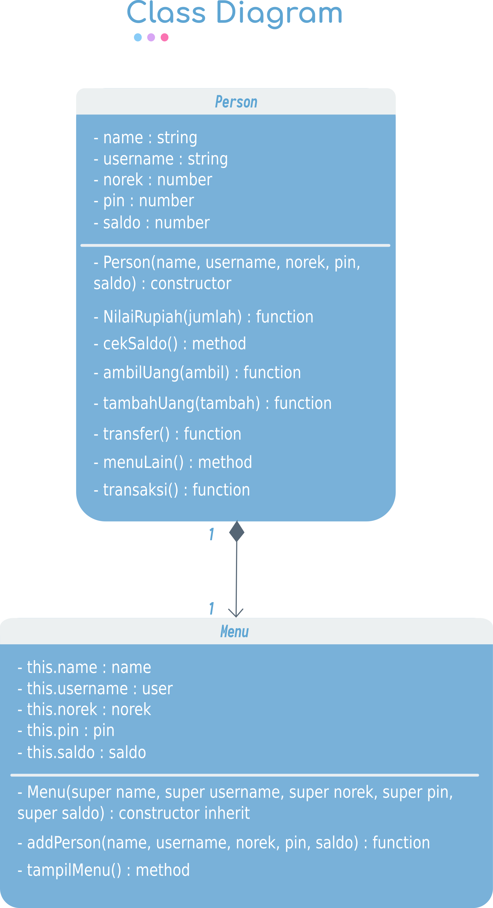
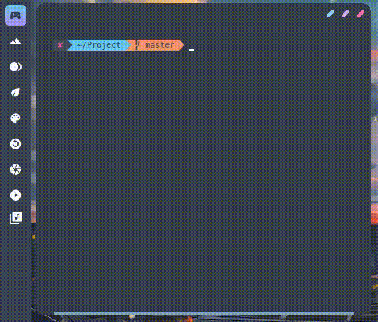
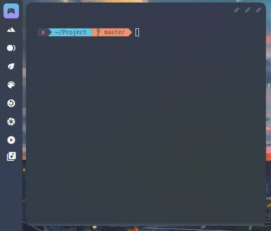
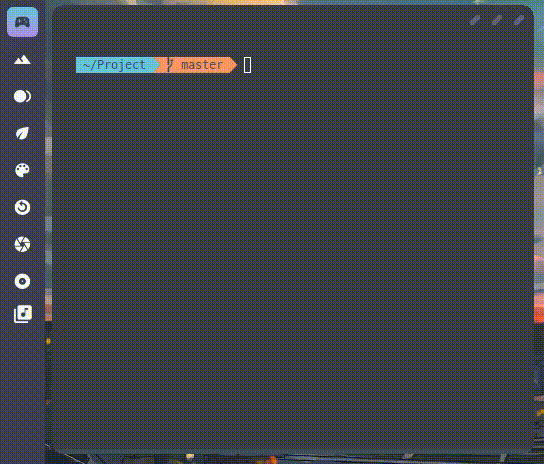
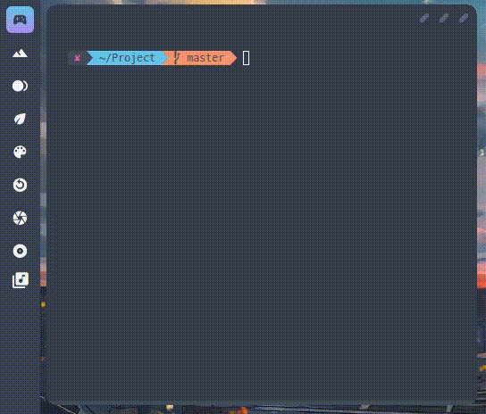
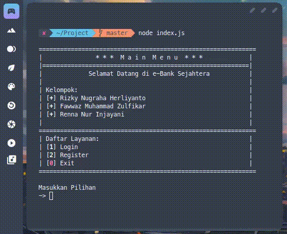
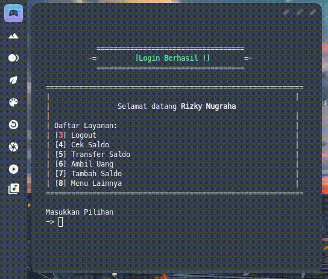
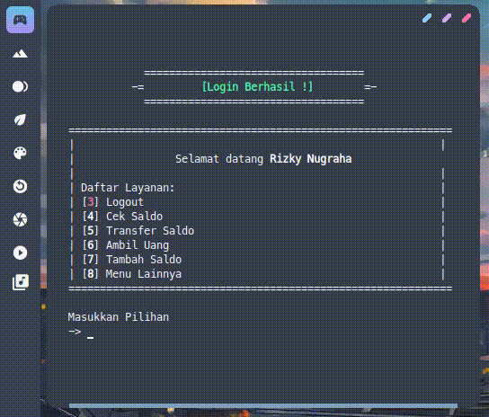

<p align="center">
  <a name="top" href="#octocat-hi-there-thanks-for-visiting-">
     
  </a>
</p>

## :rice_scene: Pendahuluan
Assalamualikum wr.wb, Perkenalkan kami dari Kelompok-12 yang beranggotakan :
| Nama | NIM | Kelas |
| -- | -- | -- |
| :boy: : **Rizky Nugraha Herliyanto** | 19104014 | SE03A |
| :boy: : **Fawwaz Muhammad Zulfikar** | 19104058 | SE03A |
| :woman: : **Renna Nur Injayani** | 18104019 | SE02A/SE03A |

Disini kami membuat program e-bank sederhana dengan nama e-bank sejahtera dengan konsep OOP (Object Oriented Programming) pada bahasa pemrograman Javascript guna untuk menyelesaikan tugas besar pada mata kuliah pemrograman berorientasi objek yang diampu oleh bapak dosen <em>Ariq Cahya Wardhana, S.Kom., M.Kom</em> dan juga dibantu oleh asisten praktikumnya yaitu Kak <em> Bagus Bayu Sasongko </em> dan <em> Kak Ajeng Fitria </em>, berkat semuanya akhirnya kami menyelesaikan tugas ini, walapun masih banyak kekurangannya.

Pada dasarnya aplikasi ini e-banking ini adalah sebuah layanan perbankan  yang menggunakan  media elektronik  sebagai  perantarannya,sehingga  nasabah t idak lagi dilayani oleh teller ataupun costumer services. Tujuan dari E-banking adalah sebagai sarana penyediaan multi channeldan juga dapat menghemat biaya transaksi bank, nasabah lebih  bebas, mudah, cepat dan aman bertransaksi 24 jam dimanapun nasabah berada.

**Powered by:**

<a href="https://nodejs.org/en/">
  
</a>
<a href="https://manjaro.org/">
  
</a>
<a href="https://www.microsoft.com/id-id/">
  
</a>
<a href="https://www.npmjs.com/">
  
</a>

## :star: Tujuan
- Mempermudah nasabah dalam bertransaksi perbankan, karena dengan internet banking akses perbankan dapat dilakukan di komputer pribadi (personal computer) tanpa harus datang ke kantor cabang.
- Mempercepat kegiatan transaksi perbankan, hanya dengan  modal computer pribadi, nasabah dapat mengakses transaksi apapun dengan komputer. Tanpa membuang-buang waktu untuk datang dan mengisi formulir di kantor cabang.
- Menghemat biaya seperti menghemat ongkos jalan ke kantor cabang.

## :cyclone: Cara Penggunaan

### Cara Running Program

untuk merunning/menjalankan program ini yaitu bisa dengan ***2*** cara, yaitu :

1. **Memakai IDE Online**

untuk memakai IDE Online contohnya bisa menggunakan website dari <em>Repl.it</em>, jika ingin menjalankannya anda bisa langsung mengcopy program filenya lalu paste ke <em>Repl.it</em> atau jika anda tidak mau yang ribet anda bisa langsung klik icon di bawah ini:

[](https://repl.it/@lordacil/tubes-PBO)

2. **Memakai IDE/Text Editor Offline(berbentuk software)**

cara yang kedua ini cukup ribet ya karena kita diharuskan sudah menginstall beberapa package terlebih dahulu agar program bisa di jalankan, berikut caranya :

### Install Node JS

 <details>
  <summary>install di <kbd>Windows</kbd></summary>
  
 - ```bash
    Download NodeJS (Included NPM) di situs resminya pilih yang windows installer dan sesuaikan bitnya
    ```
  - ```bash
    Tinggal ikuti perintah step-by-stepnya
    ```
  - ```bash
    $ node -v  # jika sudah selesai ketik command berikut pada terminal kalian untuk mengecek versi dan jika bisa berarti sudah tersintall
    $ npm -v  # jika sudah selesai ketik command berikut pada terminal kalian untuk mengecek versi dan jika bisa berarti sudah tersintall
    ```
  - berikut link lengkap tutorialnya : [install-NPM-dan-NodeJS-Windows](https://blogs.masterweb.com/cara-install-npm-di-windows/)
  
  </details>
  
  <details>
  <summary>install di <kbd>Arch Linux</kbd></summary>
  
  - ```bash
    Install NodeJS lewat Pacman
    ```
  - ```bash
    $ sudo pacman -Sy nodejs  # ketik command berikut pada terminal kalian:
    ```
  - ```bash
    masukkan password user kalian lalu ketik (y) untuk setuju
    dan tunggu proses download dan installna selesai secara otomatis......
    ```
  - ```bash
    Dan NodeJS pun seharusnya telah terinstall di laptop/pc kalian
    ```
  - ```bash
    $ node -v  # ketik command berikut pada terminal kalian untuk mengecek versi dan jika bisa berarti sudah tersintall
    ```
  
  </details>

### Install NPM

 <details>
  <summary>install di <kbd>Windows</kbd></summary>
  
 - ```bash
    Download NodeJS (Included NPM) di situs resminya pilih yang windows installer dan sesuaikan bitnya
    ```
  - ```bash
    Tinggal ikuti perintah step-by-stepnya
    ```
  - ```bash
    $ node -v  # jika sudah selesai ketik command berikut pada terminal kalian untuk mengecek versi dan jika bisa berarti sudah tersintall
    $ npm -v  # jika sudah selesai ketik command berikut pada terminal kalian untuk mengecek versi dan jika bisa berarti sudah tersintall
    ```
  - berikut link lengkap tutorialnya : [install-NPM-dan-NodeJS-Windows](https://blogs.masterweb.com/cara-install-npm-di-windows/)
  
  </details>
  
  <details>
  <summary>install di <kbd>Arch Linux</kbd></summary>
  
  - ```bash
    Install NPM lewat Pacman
    ```
  - ```bash
    $ sudo pacman -S npm  # ketik command berikut pada terminal kalian:
    ```
  - ```bash
    masukkan password user kalian lalu ketik (y) untuk setuju
    dan tunggu proses download dan installna selesai secara otomatis......
    ```
  - ```bash
    Dan NPM pun seharusnya telah terinstall di laptop/pc kalian
    ```
  - ```bash
    $ npm -v  # ketik command berikut pada terminal kalian untuk mengecek versi dan jika bisa berarti sudah tersintall
    ```
  
  </details>
  
  ### Install Package Prompt-sync

 <details>
  <summary>install di <kbd>Windows</kbd></summary>
  
  - ```bash
    Pastikan anda sudah menginstall NPM dan Node.JS-nya
    ```
  - ```bash
    $ npm install prompt-sync -g  # lalu ketik command berikut pada cmd/shell/terminal kalian:
    ```
  - Dan package prompt-sync pun seharusnya telah terinstall di laptop/pc kalian secara global
  
  </details>
  
   <details>
  <summary>install di <kbd>Arch Linux</kbd></summary>
  
  - ```bash
    Pastikan anda sudah menginstall NPM dan Node.JS-nya
    ```
  - ```bash
    $ npm install prompt-sync -g  # lalu ketik command berikut pada cmd/shell/terminal kalian:
    ```
  - Dan package prompt-sync pun seharusnya telah terinstall di laptop/pc kalian secara global
  
  </details>
  
   ### Install Package Chalk
  
  <details>
  <summary>install di <kbd>Windows</kbd></summary>
  
   - ```bash
    Pastikan anda sudah menginstall NPM dan Node.JS-nya
    ```
  - ```bash
    $ npm install chalk -g  # lalu ketik command berikut pada cmd/shell/terminal kalian:
    ```
  - Dan package chalk pun seharusnya telah terinstall di laptop/pc kalian secara global
  
  </details>
  
  <details>
  <summary>install di <kbd>Arch Linux</kbd></summary>
  
   - ```bash
    Pastikan anda sudah menginstall NPM dan Node.JS-nya
    ```
  - ```bash
    $ npm install chalk -g  # lalu ketik command berikut pada cmd/shell/terminal kalian:
    ```
  - Dan package chalk pun seharusnya telah terinstall di laptop/pc kalian secara global
  
  </details>

kalau sudah terinstall semuanya tinggal kita compile filenya menggunakan node.js, buka cmd/shell atau terminal kalian lalu ketik:

``` bash
    $ node (nama-file-programnya)
    $ node index.js
```

## :bookmark_tabs: Class Diagram UML



## :star2: Fitur Program

### Login



### Register



### Logout



### Cek Saldo



### Transfer Saldo



### Ambil Saldo



### Tambah Saldo



## Menu Lainnya

### Pembelian Pulsa


### Pembayaran Listrik


## :video_camera: Video Penjelasan Coding, Class Diagram, dan Running Aplikasinya

berikut link video youtube tentang penjelasan coding, class diagram, dan running aplikasi bisa di klik pada icon di bawah ini:

<a href="https://youtu.be/5s-7U29tAkI">
  
</a>

## :inbox_tray: Package yang digunakan
  1. [Prompt-Sync](https://www.npmjs.com/package/prompt-sync) - Digunakan untuk menginput di node.js  
  2. [Chalk](https://www.npmjs.com/package/chalk) - Digunakan untuk memberi warna pada text.
